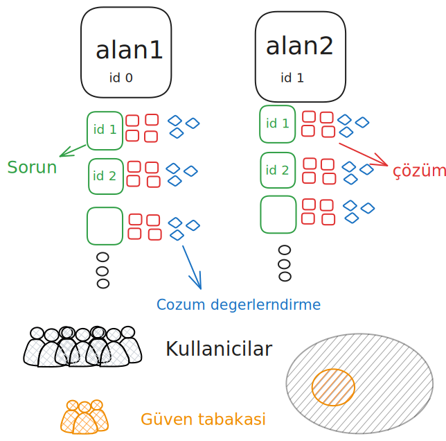
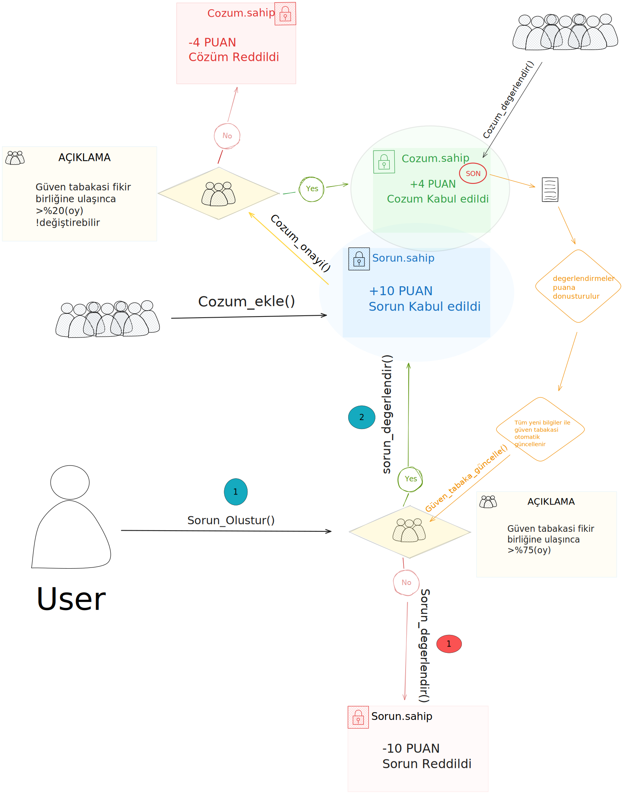

# 🛠 Merkeziyetsiz Sorun Çözüm ve Yönetim CLI Uygulaması

Bu proje, kullanıcıların sorun bildirimi, çözüm ekleme, değerlendirme ve yönetim süreçlerini **komut satırı arayüzü (CLI)** üzerinden gerçekleştirmelerini sağlar. Temel olarak bir merkeziyetsiz yönetim sürecini simüle eder.

## Genel Dizayn

<p align="center">
  
</p>


## Çözüm/Sorun Değerlendirme Akış Diyagramı

<p align="center">
  
</p>

### 3. Gerekli Paketleri Kurun

```bash
pip install typer[all]
```

## 🧭 Kullanım

CLI komutlarını `cli.py` üzerinden çalıştırabilirsiniz:

#   Projenin dizinine gelerek CLI üzerinde etkileşimli moda geçmelisiniz.

```bash
python cli.py repl
```
Komutlar kullanımı hazır hale gelir.
İnteraktif bir terminal açar. `exit` veya `Ctrl+D` ile çıkabilirsiniz.

## 📘 Komutlar

### 👤 Kullanıcı Oluştur

```bash
 kullanici-olustur [ADRES]
```

### 🛡 Yetkili Oluştur
```bash
 yetkili-olustur [ADRES]
```

### 🗂 Alan Oluştur
Sadece yetkili adresler alan oluşturabilir o yüzden yetkili bir adres oluşturduğunuzdan emin olun.
Güven tabakasi için Yeterli sayıda kullanici oluşturunuz.En az 3 kullanici
```bash
 alan-olustur [ADRES] [ALAN_ADI] -g a,b,c
```

### 📝 Sorun Oluştur
Kullanici sorun oluşturabilir.
```bash
 sorun-olustur [ADRES] [ICERIK] [ALAN_ID]
```

### ✅ Sorun Değerlendir
Sorunun aktif olması için güven tabakasinda olanların en az 2/3'si onay vermesi lazım 
Bu fonksiyon güven tabakasındaki kullanıcıların sorunu değerlendirmesi içindir
tercih 1 ise sorunu kabul eder  tercih 0 reddeder.
```bash
 sorun-degerlendir [ALAN_ID] [SORUN_ID] [ADRES] --tercih 1
```

### 💡 Çözüm Ekle
Sorun'a Çözüm ekler ama ilk olarak sorunun Güven tabakasından geçmesi gerekir.
```bash
 cozum-ekle [ALAN_ID] [SORUN_ID] [ICERIK] [ADRES]
```

### 🟩 Çözüm Onayı
Çözümlerin güven tabakasından sorun eklemeye nazaran daha az kabul olarak geçmesi lazım aktif olması için.
```bash
 cozum-onayi [ALAN_ID] [SORUN_ID] [COZUM_ID] [ADRES] --tercih 1
```

### ⭐ Çözüm Yıldız Değerlendirme
Aktif çözümlerin değerlendirilmesi.
```bash
 cozum-degerlendir [ALAN_ID] [SORUN_ID] [COZUM_ID] --yildiz 5 [ADRES]
```

## 📄 Örnek Senaryo
Etkileşimli Modda olduğunuzdan emin olun!
```bash
yetkili-olustur y1
kullanici-olustur k1
kullanici-olustur k2
kullanici-olustur k3
kullanici-olustur k4


alan-olustur y1 Yazilim -g k1,k2,k3,k4
alan-olustur y1 deneme -g k1,k2,k3

sorun-olustur k4 "Uygulama1" 0
sorun-olustur k4 "Uygulama2" 1

sorun-degerlendir 0 1 k1  --tercih 1 
sorun-degerlendir 0 1 k2  --tercih 1 
sorun-degerlendir 0 1 k3  --tercih 1 

sorun-degerlendir 1 1 k1  --tercih 0
sorun-degerlendir 1 1 k2  --tercih 0 
sorun-degerlendir 1 1 k3  --tercih 0 


cozum-ekle 0 1 "Versiyondegistir" k3
cozum-ekle 0 1 "Versiyondegistir" k2

cozum-onayi 0 1 1 k2 --tercih 1
cozum-onayi 0 1 1 k3 --tercih 1

cozum-onayi 0 1 2 k3 --tercih 0
cozum-onayi 0 1 2 k2 --tercih 0

cozum-degerlendir 0 1 1 --yildiz 5 k3
cozum-degerlendir 0 1 1 --yildiz 5 k2
cozum-degerlendir 0 1 1 --yildiz 5 k1

```


## Goals

- [x] CLI üzerinden proje simülasyonu 
- [ ] IPFS bağlantısının eklenmesi / Ram Optimizasyonu
- [ ] Web arayüzü  entegrasyonu  
- [ ] Blokzincir/Kontrat entegrasyonu 
- [ ] Güvenlik Katmanı ve ZK entegrasyonu


